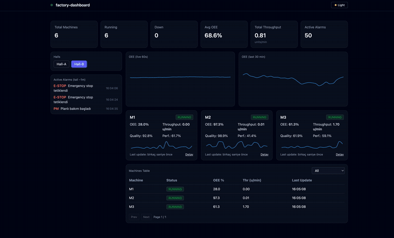

**README.md**

<p align="center">
  
</p>


# factory-dashboard — Real-Time Production Monitoring (React + Node.js)
---

## EN (Simple)

### What is this?
A live factory dashboard.
There are 2 halls (Hall-A, Hall-B) and 6 machines.
You see KPIs, OEE charts, machine cards, and a table.

### Why?
To show clean code and a nice UI.
It is good for demo and learning.

### Main Features
- Live data by **WebSocket**. Fallback is **polling**.
- KPI bar: total machines, running, down, avg OEE, throughput, alarms.
- Two OEE charts: **live 60s** and **last 30 min**.
- Machine cards with status colors and mini sparkline.
- Table with filter, sort, pagination.
- **Dark / Light** theme (remembered in localStorage).
- Docker support.

### Tech Stack
**Frontend:** React + Vite, Zustand, React Router, Recharts, TanStack Table v8, Tailwind, dayjs
**Backend:** Node.js, Express, ws, zod, cors, helmet, pino

### Architecture (short)


Frontend (React)

* Zustand store (summary, halls, machines, alarms, ws status)
* Components (KpiCard, HallSelector, MachineCard, TrendMiniChart, MachineTable)
* WebSocket client (/ws) + REST API (/api)

Backend (Express)

* routes → controllers → services → utils (zod validation)
* DataService: mock metrics, events, 24h history (1 min)
* MetricsService: update timer
* WebSocket: telemetry broadcast, hall subscribe

````

### Run (Dev)
```bash
# Backend
cd backend
cp ../.env.example .env   # or create backend/.env
npm i
npm run dev   # http://localhost:4000 (WS: /ws)

# Frontend
cd ../frontend
cp .env.example .env
npm i
npm run dev   # http://localhost:5173
````

### Run (Docker)

```bash
docker compose up -d
# Frontend: http://localhost:5173
# Backend : http://localhost:4000
```

### Env Examples

**backend/.env**

```env
BACKEND_PORT=4000
CORS_ORIGIN=http://localhost:5173
WS_PATH=/ws
NODE_ENV=development
MOCK_SPEED_FACTOR=1
UPDATE_INTERVAL_MS=500
WS_BROADCAST_INTERVAL_MS=500
VOLATILITY_MULTIPLIER=2
DOWN_PROB_PER_SEC=0.003
RECOVERY_PROB_PER_SEC=0.05
ALARM_EXTRA_RATE=0.01
HALL_CORRELATION=0.35
```

**frontend/.env**

```env
VITE_API_BASE=http://localhost:4000/api
VITE_WS_URL=ws://localhost:4000/ws
```

### API (Quick)

* `GET /api/summary`
* `GET /api/halls`
* `GET /api/halls/:id`
* `GET /api/machines?status=&hallId=&page=&pageSize=`
* `GET /api/machines/:id/metrics`
* `GET /api/events?since=ISO`

**WebSocket**

* Subscribe:

```json
{ "type": "subscribe", "hallId": "hall-a" }  // null = all
```

* Telemetry:

```json
{ "type": "telemetry", "payload": { "machineId": "m-a-1", "metrics": { ... }, "ts": "ISO" } }
```

### How I used AI (short)

* Planning the folder tree and layers.
* Generating base of the components and routes.
* Fixing TanStack v8 API and small deployment bugs.
* Writing docs and checklists.

**Efficiency:** AI helped me move fast. I still reviewed all code, validations, and security.


## TR (Detaylı)

### Proje Nedir?

Gerçek zamanlı bir fabrika dashboard’u.
**2 hol / 6 makine**, üstte KPI’lar, sağda OEE grafikleri (canlı + 30dk), altta makine kartları ve tablo.

### Neden?

* **Vitrinlik** bir proje: temiz mimari, şık UI.
* Junior’lar için **Türkçe yorumlar** ve okunabilir kod.
* Docker ile **kolay kurulum**.

### Öne Çıkanlar

* **WebSocket** ile saniyelik telemetri, **polling fallback**.
* KPI bar: Total Machines, Running, Down, Avg OEE, Total Throughput, Active Alarms.
* OEE (live 60s) + OEE (last 30 min) **yan yana**.
* MachineCard içinde **mini throughput sparkline**.
* TanStack Table v8 ile filtre/sıralama/pagination.
* **Dark/Light** tema (localStorage’da saklanır).
* Güvenlik: helmet, cors; zod ile DTO doğrulama; pino ile JSON log.

### Teknolojiler

**Frontend:** React + Vite, Zustand, React Router, Recharts, TanStack Table v8, Tailwind, dayjs
**Backend:** Node.js, Express, ws, zod, cors, helmet, pino

### Mimari (özet)

* **Frontend**

  * Zustand global store: `summary, halls, selectedHallId, machines, alarms, connectionStatus`
  * Bileşenler: `KpiCard, HallSelector, MachineCard, TrendMiniChart, MachineTable, AlarmList, StatusPill, LastUpdateBadge`
  * WS client: otomatik reconnect + backoff; WS yoksa 10 sn polling
* **Backend**

  * Katmanlar: routes → controllers → services → utils (zod şemaları)
  * `DataService`: random-walk mock, 24 saatlik 1dk çözünürlüklü tarihçe, event kuyruğu
  * `MetricsService`: env ile hız/volatilite; mikro-duruş, hall-shock, eşik bazlı alarm
  * `ws`: `/ws` kanalında telemetry yayını; `subscribe` ile hall filtreleme

### Kurulum

**NPM (dev)**

```bash
cd backend && cp ../.env.example .env && npm i && npm run dev
cd ../frontend && cp .env.example .env && npm i && npm run dev
# Frontend: http://localhost:5173  Backend: http://localhost:4000
```

**Docker**

```bash
docker compose up -d
```

### Ortam Değişkenleri

`backend/.env` ve `frontend/.env` örnekleri yukarıdaki EN bölümünde yer alıyor (birebir aynı).

### API Kısaca

* `GET /api/summary` • `GET /api/halls` • `GET /api/halls/:id`
* `GET /api/machines` (filtre & sayfalama)
* `GET /api/machines/:id/metrics` (24h / 1dk)
* `GET /api/events?since=ISO`

**WebSocket**

* `subscribe` → `{ "type":"subscribe", "hallId":"hall-a" }`
* `telemetry` → `{ "type":"telemetry", "payload": { "machineId","metrics","ts" } }`

### AI Nasıl Kullandım?

* **Planlama:** klasör ağacı, katmanlar, görev listesi.
* **Hızlı üretim:** bileşen ve servis şablonları (ben modülerlik/tek dependency için sadeleştirdim).
* **Uyarlama:** TanStack v8’e geçiş, WS/polling fallback, dark/light teması.
* **Hata ayıklama:** import/izin/paket sorunlarının teşhisi ve deployment hata düzeltmeleri.
* **Dokümantasyon:** README, check-list ve komut örnekleri.

**Etkisi:** MVP çıkış süresi ciddi kısaldı; ancak **doğrulama, güvenlik ve mimari kararlar bende** kaldı.
Bu yaklaşım ile teslim süresi **günler yerine saatler** seviyesine indi.


